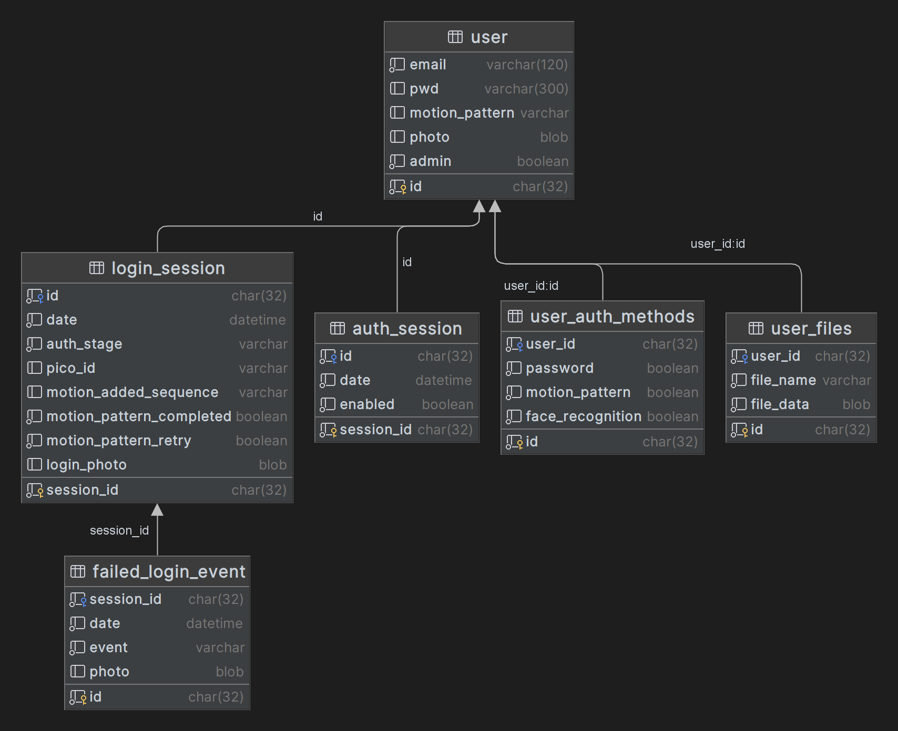

# Admin System Backend

## Table of Contents
1. [Setup](#setup)
2. [Usage](#usage)
   1. [Docker](#docker)
   2. [Local](#local)
3. [Documentation](#documentation)
   1. [API](#api)
   2. [Files](#files)
   3. [Database](#database)

## Setup

> **Note**
> Skip to the [`Usage -> Docker`](#docker) section if you want to run the Docker image instead of installing and running locally.

1. Install `pipenv`. See the [documentation](https://pipenv.pypa.io/en/latest/) if you run into any issues with it.
   ```shell
   pip install --user pipenv
   ```

2. Install dependencies:
   > **Note**
   > Expects that you have Python 3.11
    ```shell
    pipenv sync --dev
    ```
3. Run the Machine Learning model generation script:
   ```shell
   cd ../../machine-learning
    ```
    ```shell
   pip install -r requirements.txt
   ```
    ```shell
   python model.py
   ```
   ```shell
   cd ../admin-system/backend
   ```
4. Move the generated model into `admin-system/backend/instance/`

5. Copy the [`.env.example`](/admin-system/backend/.env.example) file to `.env` and fill in the `SECRET_KEY` with a randomized value.

## Usage

### Docker

#### Pull the image
```shell
docker pull ghcr.io/computing-collective/3fa-backend:latest
```

#### Copy the instance folder from the container
```shell
mkdir -p instance
docker run -d --name copy ghcr.io/computing-collective/3fa-backend:latest
# Check if the container is running (value should be "running")
docker container inspect -f '{{.State.Status}}' copy
# If it isn't running, wait try the run command again
sleep 20 # Wait 20 seconds for the container to initialize
docker stop copy
docker cp copy:/usr/src/instance/ ./
docker rm copy
```

#### Run the container

For the following commands, replace `%cd%` with the appropriate current directory command for your shell as follows:
- Windows Command Prompt: `"%cd%"`
- Windows PowerShell: `${PWD}`
- Linux: `"$(pwd)"`

Also be sure to replace `secret_to_replace` with a randomized value.

> **Note**
> You will need your laptop's Wi-Fi hotspot turned on to use this IP address. You can always change the IP address to localhost if you don't want to do this.
```shell
docker run -p 192.168.137.1:5000:5000 --name admin-server --mount type=bind,src="%cd%/instance",target=/usr/src/instance -e "SECRET_KEY=secret_to_replace" ghcr.io/computing-collective/3fa-backend:latest
```
Access the server at [192.168.137.1:5000](http://192.168.137.1:5000)

With `localhost`:
```shell
docker-compose up # From the admin-system/backend directory and be sure to have a .env file with SECRET_KEY="secret_to_replace"
OR
docker run -p 5000:5000 --name admin-server --mount type=bind,src="%cd%/instance",target=/usr/src/instance -e "SECRET_KEY=secret_to_replace" ghcr.io/computing-collective/3fa-backend:latest
```
Access the server at [localhost:5000](http://localhost:5000)

#### Run tests with coverage
```shell
docker run --rm -e "SECRET_KEY=secret_to_replace" ghcr.io/computing-collective/3fa-backend:latest /usr/src/.venv/bin/python -m pytest --cov=api --cov-branch
```

#### Build the image
> **Note**
> You must be in the admin-system/backend directory for this command to work
```shell
docker build -t ghcr.io/computing-collective/3fa-backend:latest .
```

### Local

#### Run the server (production)
> **Note**
> Gunicorn does not run on Windows. You will need to use WSL
```shell
pipenv run gunicorn -b :5000 -w 4 'api.app:create_app()'
```
Access the server at [localhost:5000](http://localhost:5000)

#### Run the server (development mode)
> **Note**
> You will need your laptop's Wi-Fi hotspot turned on to use this IP address. You can always change the IP address to localhost if you don't want to do this.
```shell
pipenv run flask -A api.app.py --debug run -h 192.168.137.1
```
Access the server at [192.168.137.1:5000](http://192.168.137.1:5000)


With `localhost`:
```shell
pipenv run flask -A api.app.py --debug run -h 0.0.0.0
```
Access the server at [localhost:5000](http://localhost:5000)

#### Run tests with coverage
```shell
pipenv run pytest --cov=api --cov-branch
```

## Documentation

### API

Please see [`API.md`](API.md) for details on each of the endpoints. Note that there is extensive verification beyond the example requests and responses shown including timing out of tokens, content type verification, and more. Please see the code in the [`api`](api) folder for more details.

### Files

Below is a list of the key files in the project and their purpose.

```
admin-system
└─ backend
   ├─ api
   │  ├─ app.py                        # Flask app factory
   │  ├─ helpers.py                    # Helper functions for the API
   │  ├─ machine_learning_eval.py      # Face recognition evaluation
   │  ├─ models.py                     # SQLAlchemy models - see the "Database" section below for more details
   │  └─ routes
   │     ├─ admin.py                   # Admin dashboard routes
   │     ├─ base.py                    # Base routes (health and index)
   │     ├─ client.py                  # Client application routes
   │     └─ errors.py                  # Error handler
   ├─ constants.py                     # Constants and definitions used throughout the project
   ├─ docker-compose.yml
   ├─ Dockerfile
   ├─ instance                         # Folder containing the machine learning model, the database, and user-uploaded files
   │  └─ ...
   ├─ Pipfile                          # Pipenv file for dependencies
   ├─ Pipfile.lock                     # Pipenv lock file
   ├─ pytest.ini                       # Pytest configuration
   └─ tests
      ├─ conftest.py                   # Pytest fixtures and configuration to be used across multiple tests
      ├─ data
      │  ├─ mock_data.txt              # Mock file for testing
      │  └─ user1.png                  # Mock image for testing
      ├─ functional
      │  ├─ test_admin.py              # Admin dashboard tests
      │  ├─ test_base.py               # Base route tests
      │  └─ test_client.py             # Client application tests
      ├─ unit
      │  ├─ test_factory.py            # Flask app factory tests
      │  ├─ test_helpers.py            # Helper function tests
      │  ├─ test_machine_learning.py   # Face recognition evaluation tests
      │  └─ test_models.py             # SQLAlchemy model tests
      └─ __init__.py                   # Empty file to allow pytest to find the tests folder
```
### Database

The database is organized into the following tables. Specific table details and their fields can be found in [`models.py`](api/models.py).


