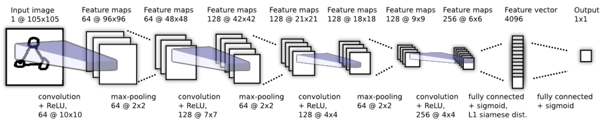

# Face recognition ML model

## Goal

The goal of our model is to serve as a last-step in the sign-in process for the 3FA system. The model will be used to verify the identity of the user after they have successfully completed the other two steps of the 3FA system.

When approachign the problem, one of our main goals was to *not* train on the user's data. This is because we wanted to avoid the sign-up process to require more than 1 picture of the user's face. To avoid this, we decided to go ahead with a "one-shot" model - a model that tries to match two images and see if they contain the same person. The model we used is from [this paper](https://www.cs.cmu.edu/~rsalakhu/papers/oneshot1.pdf).

## Description

The model is a Siamese network, which means that it takes two images as input and outputs a single value that represents the similarity between the two images. The model is trained on pairs of images, where the first image is the user's face and the second image is a random face from the dataset. The model is trained to output a value close to 1 if the two images are of the same person, and a value close to 0 if they are not.

The neural network architecture is a deep learning CNN. The model is trained on the various dataset, both from the internet and some collected by us.

Here is a diagram of the deep neural network: 

Each image is passed to through the first 7 layers of the network, which are convolutional layers. The output of the convolutional layers is then flattened and passed through a fully connected layer. Then the two outputs are passed through a distance function, which outputs a single value that represents the similarity between the two images.

## Training & Evaluation

In total, we had a dataset of ~600 people, each of which had ~10 images. We split the dataset into a training set and a validation set, with a 80/20 split. We then trained the model on the training set and evaluated it on the validation set. We trained the model for 10 epochs, and the final accuracy on the validation set was ~94%.
